# BantayAralan Feasibility Study

**BantayAralan: Real-Time Student Behavior and Classroom Orderliness System**
BSCpE Capstone/Thesis Project — School of Engineering and Architecture, Holy Angel University
Prepared by Team 8 (Chloe Lane B. Jose, Raynier Ronn G. Santos, Justin Rieko S. Tolentino)

> **Reading this document.** This feasibility study follows the status
> labels used throughout the project's `Knowledge/` vault and root
> `CLAUDE.md`: **Implemented**, **Partially implemented**, **Planned**,
> **Proposal requirement**, **Expected by current working draft**, **Not yet
> implemented**, **Under consideration**, **Unclear**, **Deprecated**,
> **Changed from proposal**. A status label is attached to every material
> claim below. This document is a working draft, has not been reviewed by
> the thesis adviser, and is not legal advice — Section 6 in particular
> should be validated with the university's legal/ethics office and the
> adviser before any classroom deployment.

## Table of Contents

1. [Project / Executive Overview](#1-project--executive-overview)
2. [Market / User / Need Feasibility](#2-market--user--need-feasibility)
3. [Technical Feasibility](#3-technical-feasibility)
4. [Operational and Organizational Feasibility](#4-operational-and-organizational-feasibility)
5. [Economic / Financial Feasibility](#5-economic--financial-feasibility)
6. [Legal and Regulatory Feasibility](#6-legal-and-regulatory-feasibility)
7. [Schedule Feasibility](#7-schedule-feasibility)
8. [Risk Analysis](#8-risk-analysis)
9. [Alternatives Analysis](#9-alternatives-analysis)
10. [Assumptions and Evidence Gaps](#10-assumptions-and-evidence-gaps)
11. [Conclusion](#11-conclusion)
12. [References](#12-references)

---

## 1. Project / Executive Overview

### 1.1 What BantayAralan is

BantayAralan is a proposed computer-vision system intended to help a
classroom teacher notice, log, and review two categories of condition
without watching the room continuously: **disruptive student behavior**
(e.g., standing) and **classroom disorder** (out-of-place objects/clutter
and misaligned seats or desks). Detected conditions are meant to become
timestamped **events** with optional screenshot/video evidence, reviewable
by the teacher — not real-time alarms, and not an automated disciplinary
system (*Status: Proposal requirement / Expected by current working draft*
— see [Knowledge/00 - Project Overview](<../Knowledge/00%20-%20Project%20Overview.md>),
[Knowledge/01 - Research/Research Proposal](<../Knowledge/01%20-%20Research/Research%20Proposal.md>)).

A companion aggregate **head-count** feature (beginning-of-class and
near-end-of-class student counts, not per-student attendance) and a
**Detection Enable/Disable** control were added in a later, not-yet-adviser-reviewed
prototype paper revision (`Prototype Paper Changes.md`; *Status: Changed
from proposal*).

### 1.2 What currently exists in the repository

| Component | Status | Where |
|---|---|---|
| Admin web application (Dashboard, Events & Logs, Event Detail, Head Count, Insights & Statistics) | **Implemented** (mock/synthetic data; Flask + vanilla JS) | `admin-ui/` |
| Automated head-count scheduler (background trigger + storage) | **Implemented** (trigger/storage/status logic real; the *captured count value* is a placeholder random integer) | `admin-ui/backend/scheduler.py` |
| Detection Enable/Disable toggle | **Implemented** (persists a flag; no detector exists yet for it to gate) | `admin-ui/backend/app.py`, `detection_state` table |
| Statistics / Classroom Insights / Suggestions | **Implemented** (real SQL aggregation and simple rule-based thresholds over the seeded mock events — not a validated analytical model) | `admin-ui/backend/app.py` |
| Camera capture, YOLOv8 detection, ByteTrack tracking, behavior/alignment logic | **Not yet implemented** | — no source code exists anywhere in this repository |
| Real event creation from a detector | **Not yet implemented** | all 42 seeded events are synthetic |
| Real screenshot/video evidence capture | **Not yet implemented** (UI simulates both) | `admin-ui/frontend/js/views/eventDetail.js` |
| CV dataset/labeling proof-of-concept | **Planned / in progress** (7 source photos, no-code labeling tool, no accuracy numbers yet) | `detection/`, `dataset/` |
| Native desktop admin UI (PySide6) | **Deprecated** — removed 2026-09-23 in favor of the web application | historical only, see [[Two Admin UI Prototypes]] |

This table is the single most important fact this study relies on: **the
reviewable admin interface is real and running against synthetic data; the
computer-vision detection layer that would make its data real does not
exist as code anywhere in this repository.** Every section below treats
these as two separate feasibility questions, not one.

### 1.3 Document scope and authority

This study synthesizes what is documented in this repository as of
2026-09-26: the working-draft research proposal
(`Team8_BantayAralan-Proposal.docx.pdf`, dated March 29, 2026), the revised,
not-yet-adviser-reviewed prototype paper (`BantayAralan-Prototype-Paper.pdf`,
`Prototype Paper Changes.md`), the `Knowledge/` vault, the `admin-ui/` and
`detection/` source trees, and the capstone architecture master document
(`DOC-CAP-FINAL-2026-008`, issued 2026-09-26), which itself lists a
Feasibility Study as one of the standalone documents still to be compiled
for the final submission package — this document is that deliverable.
Where these sources disagree, both positions are stated rather than
silently resolved (see [Section 10](#10-assumptions-and-evidence-gaps)).
This is a feasibility analysis of the proposal/working-draft direction, not
a legal opinion, not an adviser-approved plan, and not a claim that any
part of the detection pipeline has been built or tested.

### 1.4 Stakeholders

| Category | Who | Role in the system |
|---|---|---|
| Direct user | The classroom teacher | Views the Dashboard/Events/Head Count/Insights screens; the human-in-the-loop decision-maker for every logged event |
| Beneficiaries | Students in the monitored classroom | Benefit from a (intended) cleaner, less disrupted learning environment; also the subjects of aggregate, non-identifying detection |
| Beneficiaries | The school administration | Benefit from classroom-condition visibility without needing to staff continuous human observation |
| Stakeholders | Parents/guardians | Have a data-privacy interest in any classroom camera capturing their child, even without identification — see [Section 6](#6-legal-and-regulatory-feasibility) |
| Stakeholders | The thesis adviser and Holy Angel University | Own the academic evaluation of the proposal and (per `DOC-CAP-FINAL-2026-008`) have not yet reviewed the current working direction |
| Potential future adopters | Other classrooms/schools, if the prototype is generalized | Not evaluated in this repository — see [Section 2](#2-market--user--need-feasibility) |

---

## 2. Market / User / Need Feasibility

BantayAralan is an academic capstone prototype for a single classroom, not
a commercial product with a market to size. This section therefore assesses
**need and adoption context**, not market share, revenue potential, or user
counts — no figures of that kind are asserted anywhere below unless a
specific source is cited.

### 2.1 The problem being addressed

The proposal's own cited literature frames two linked classroom-management
burdens on teachers: monitoring student behavior while teaching, and
maintaining a clean, orderly classroom. Cited studies report that
classroom-management difficulty (handling disruptive behavior specifically)
is a common, ongoing challenge for teachers, and that classroom
cleanliness/orderliness is linked to student engagement and academic
performance (Ćali, Lazimi, & Ippoliti, 2024; Dilabayan & Sambo, 2024;
Hamidi et al., 2024; Reyes et al., 2024) — see
[Knowledge/01 - Research/Research Proposal](<../Knowledge/01%20-%20Research/Research%20Proposal.md>).
*Status: Proposal requirement* — these are the cited motivating problems,
not measurements this project has independently collected; no pre-implementation
teacher survey has been run in this repository yet (*Status: Not yet
implemented*, see [Knowledge/09 - Testing & Evaluation](<../Knowledge/09%20-%20Testing%20&%20Evaluation.md>)).

A separately cited context: Philippine teachers report administrative and
non-teaching burdens (e.g., paperwork) competing for their attention during
class time (Magsambol, 2025), which is consistent with, though not direct
evidence for, the proposal's framing that continuous manual behavior/clutter
monitoring is costly for a teacher already delivering instruction.

### 2.2 Direct users, beneficiaries, and stakeholders

See [Section 1.4](#14-stakeholders). The **direct user** is a single
classroom teacher operating the admin interface; **students are not users**
of the system — they are the (non-identified) subjects of detection.
*Status: Working decision*, per [Knowledge/07 - UI UX/UI UX Overview](<../Knowledge/07%20-%20UI%20UX/UI%20UX%20Overview.md>)
("admin-only interface, no student-facing UI anywhere in the repo").

### 2.3 Target environment and its limitations

The proposal scopes the system to **public grade-school classrooms**
(*Status: Proposal requirement*, [Knowledge/01 - Research/Scope and Limitations](<../Knowledge/01%20-%20Research/Scope%20and%20Limitations.md>)),
selected via purposive sampling of teachers who would evaluate the system
(*Status: Proposal requirement*, [Knowledge/01 - Research/Methodology](<../Knowledge/01%20-%20Research/Methodology.md>)).
No specific school, grade level, or classroom has been documented as a
confirmed pilot site in this repository. The environment itself constrains
technical feasibility (see [Section 3](#3-technical-feasibility)): classroom
clutter, seating density, lighting variability, and object occlusion are
explicitly acknowledged in the proposal as conditions that can reduce
detection accuracy (*Status: Proposal requirement*).

### 2.4 Existing approaches and comparable systems

Three broad existing approaches already address parts of this space, none
of which are documented as evaluated head-to-head against BantayAralan
within this repository (a structured comparison is given in
[Section 9](#9-alternatives-analysis)):

- **Teacher-only observation** — the status quo; no technology involved.
- **Conventional CCTV** — records video but does not analyze it; a human
  must still watch or review footage manually.
- **Published classroom-behavior computer-vision research** — the
  proposal cites several systems (skeleton-pose-based behavior recognition:
  Lin et al., 2021; YOLOv8-based classroom behavior detection: Sheng, Li, &
  Chan, 2025; online-teaching behavior capture: Yang, 2024) reporting
  detection accuracies in the ~95–97% range under their own study
  conditions. **These are third-party research results, not measurements of
  BantayAralan** — no equivalent number exists for this project yet (*Status:
  Not yet implemented*, see [Knowledge/04 - Computer Vision](<../Knowledge/04%20-%20Computer%20Vision.md>)
  and [Section 3.4](#34-performance)).

### 2.5 Adoption considerations

- A single-classroom, admin-only, no-login deployment (current UI scope)
  lowers the adoption bar technically but does not by itself address
  consent, multi-teacher use, or multi-classroom rollout — all explicitly
  **Under consideration** or **Unclear**, per
  [Knowledge/12 - Open Questions](<../Knowledge/12%20-%20Open%20Questions.md>)
  ("whether authentication will ever be necessary," "deployment architecture
  beyond the current admin-UI prototype").
- Institutional use beyond the pilot classroom (e.g., school-wide rollout)
  is not discussed anywhere in the current documents and should not be
  assumed as a goal of this capstone phase.
- No user counts, school counts, demand surveys, or market-share figures
  are asserted in this study; none exist in the repository, and none are
  fabricated here, per the scope of this task.

---

## 3. Technical Feasibility

### 3.1 Hardware

| Item | Status | Detail |
|---|---|---|
| Camera model | **Working decision** (2026-09-24) | TP-Link VIGI C320I — 2MP PoE (802.3af/at) dome/bullet IR network camera, H.265+ compression, IP67-rated, available in 2.8/4/6 mm fixed-lens variants (TP-Link, n.d.-a; Bermorzone, n.d.) |
| Camera role coverage | **Unclear** | Whether one VIGI C320I unit covers *both* the ceiling-mounted (behavior) and top-down (clutter/alignment) roles, or one unit is needed per role, is not confirmed anywhere — see [Knowledge/08 - Hardware](<../Knowledge/08%20-%20Hardware.md>) |
| Camera ingest protocol | **Unclear / internally inconsistent across sources** | `DOC-CAP-FINAL-2026-008` §2.5 states the camera "streams over RTSP/ONVIF, standard for this class of PoE IP camera" as if already configured, but that same document's own §3.0 "Outstanding Items" lists "finalize the ingest protocol configuration" as still open, and `Knowledge/12 - Open Questions` independently flags this as unconfirmed. Treat RTSP/ONVIF as *plausible* (it is the standard protocol family for this camera class) but **not yet confirmed as this project's actual configuration** |
| Network switch | **Working decision** (2026-09-26, communicated directly by the project team during this study's preparation) | TP-Link TL-SG1005LP — 5-port Gigabit desktop switch, 4× PoE+ ports, 40 W total PoE budget (TP-Link, n.d.-b) |
| Processing PC — full specification | **Working decision** (2026-09-26, communicated directly by the project team) | CPU: AMD Ryzen 5 5600; GPU: NVIDIA GeForce RTX 2060; RAM: 16 GB, 3200 MHz (Team Group Vulcan Z); Storage: 256 GB M.2 SSD (Team Group TM8PS7512G) + 1 TB HDD (Seagate ST31000524AS) |
| Processing PC — form factor, drive assignment | **Unclear** | Desktop vs. laptop is inferred (likely desktop, given the discrete-GPU + separate SSD/HDD layout), not confirmed; which drive would host the local database/evidence store is not stated |
| PoE infrastructure | **Working decision** (implied by camera + switch choice) | A PoE camera drawing power and data over one Ethernet run per camera, terminating at the TL-SG1005LP's 4 PoE+ ports — sufficient for up to 4 PoE devices, which comfortably covers a 1–2 camera deployment |
| Mounting/installation | **Unclear** | Only "ceiling-mounted" and "top-down" are specified; no exact height, angle, FOV, or bracket/cabling plan exists |

**Assessment.** The confirmed pieces (camera, switch, and the full
processing-PC specification) are all consumer/small-business-grade
components that are individually well understood and readily available in
the Philippine retail market (see [Section 5](#5-economic--financial-feasibility)
for pricing). Nothing about this specific combination is technically
implausible for a single-classroom pilot. The remaining open items (camera
role count, ingest protocol, PC form factor/drive assignment, mounting
plan) are ordinary pre-deployment engineering decisions, not indications of
infeasibility — but they must be resolved before a real pilot, and none of
them should be treated as decided until a project-team or adviser record
says so.

### 3.2 Software

| Component | Suitability assessment | Status |
|---|---|---|
| Python | Standard, mature ecosystem for both the CV stack (OpenCV, PyTorch/Ultralytics) and the existing Flask backend — no suitability concerns | **Implemented** (admin-ui), **Proposal requirement** (CV pipeline) |
| OpenCV | Standard, well-supported library for frame capture/preprocessing; suitable | **Not yet implemented** |
| YOLOv8 (Ultralytics) | Actively maintained, anchor-free single-stage detector with pose-estimation support; ships multiple size variants (n/s/m/l/x) trading accuracy for speed, which matters directly for real-time feasibility on modest hardware (Ultralytics, n.d.; Jocher, Chaurasia, & Qiu, 2023) | **Working decision** (supersedes the proposal's YOLO11m — *Status: Changed from proposal*, see [Knowledge/11 - Decisions/Camera Model and Detection Model Version Confirmed](<../Knowledge/11%20-%20Decisions/Camera%20Model%20and%20Detection%20Model%20Version%20Confirmed.md>)) |
| ByteTrack | Tracking-by-detection algorithm that associates *every* detection box, including low-confidence ones, via Kalman-filter motion prediction and a two-stage IoU association — this is specifically useful for reducing head-count double-counting under partial occlusion (Zhang et al., 2022) | **Planned / Proposal requirement** — no tracking code exists yet |
| SQLite | Appropriate for this project's actual data shape: three small, independently structured tables with simple filter/sort/paginate query patterns; needs no separate DB server process, matching the local single-machine hosting decision (`DOC-CAP-FINAL-2026-008` §2.2) | **Implemented** |
| Flask | A minimal, well-understood Python web framework already running the admin UI; suitable for the project's single-process, single-classroom scope | **Implemented** |
| Vanilla JS/HTML/CSS (no framework) | Appropriate given the admin UI's modest interactivity needs (routing, fetch+render); avoids a build-tooling dependency the team would otherwise have to maintain | **Implemented** |

**Software risk concentration.** All of the *implemented* software risk sits
in a well-trodden, low-risk stack (Flask + SQLite + vanilla JS). All of the
*unimplemented* software risk sits in the CV stack (YOLOv8 + ByteTrack +
custom behavior/alignment logic), which is a materially harder engineering
problem — see [Section 3.3](#33-computer-vision-feasibility).

### 3.3 Computer vision feasibility

The proposed pipeline has two conceptually different halves that the
project's own most recent technical document (`DOC-CAP-FINAL-2026-008`
§2.4) now separates explicitly:

1. **Pretrained-model tasks** — person detection, pose estimation
   (standing behavior), and tracking. These use YOLOv8's COCO-pretrained
   weights and ByteTrack "out of the box," and per `DOC-CAP-FINAL-2026-008`
   do **not** require a custom-trained model for their core function.
   *Status: Planned* — no integration code exists yet, but the underlying
   models are mature, publicly available, and widely benchmarked for
   exactly this task class (person detection/pose estimation).
2. **Reference/zone-comparison tasks** — clutter/out-of-place-object
   detection and seat/table alignment, framed in the same document as
   comparison against a fixed top-down camera view and a reference layout,
   **not** as fine-grained object classification. This matches the
   project's explicit design direction that the system flags something as
   "out of place" without classifying what type of object it is (e.g., not
   distinguishing paper from a bottle) — see `detection/CLAUDE.md`'s "Class
   taxonomy" section and `Prototype Paper Changes.md`'s "Broader
   out-of-place objects concept."

**Tension worth flagging plainly.** `DOC-CAP-FINAL-2026-008` frames a
custom-trained clutter/alignment classifier as an *optional future
refinement*, while the repository's actual current work
([Knowledge/11 - Decisions/No-Code Tool for Initial CV Proof-of-Concept](<../Knowledge/11%20-%20Decisions/No-Code%20Tool%20for%20Initial%20CV%20Proof-of-Concept.md>),
`detection/dataset/README.md`) has **already started** exactly that: a
7-photo labeling round in Roboflow for the `trash` and `misaligned`
categories. These are not strictly contradictory (a proof-of-concept can
run ahead of a document calling it "optional"), but the project's own
documents currently disagree on whether custom training is core-path or a
later refinement. This is not resolved here — see
[Section 10](#10-assumptions-and-evidence-gaps).

**Scale honesty.** `detection/CLAUDE.md` itself states the caveat this
study repeats: a dataset in the single digits to low tens of images (the
current 7-photo round) is a **pipeline proof-of-concept**, not a usable
detector. No accuracy, precision, or recall number exists for this project
at any dataset size yet. `DOC-CAP-FINAL-2026-008` §2.4 states that a
production-oriented custom dataset (if pursued) would need "several hundred
to low-thousands of annotated images," following standard fine-tuning
practice — this is a documented plan, not a claim that such a dataset
exists.

**Two-camera pipeline independence.** The proposal's design keeps the
ceiling camera (behavior) and top-down camera (clutter/alignment) as two
largely independent processing pipelines converging only at event logging
(see [Knowledge/03 - Architecture/System Architecture](<../Knowledge/03%20-%20Architecture/System%20Architecture.md>)).
This is a sound simplification: it means a delay or failure in one
pipeline's development does not block the other, and it avoids needing a
single model to reason about two very different camera geometries at once.

### 3.4 Performance

| Metric | Planned evaluation approach | Current measured value |
|---|---|---|
| Detection precision/recall/F1/mAP | Pilot recordings + held-out annotated test set, COCO-style mAP (`DOC-CAP-FINAL-2026-008` §2.4) | **None exist** |
| Tracking ID-switch rate / MOTA / IDF1 | Same pilot evaluation | **None exist** |
| Inference latency / FPS | Wall-clock profiling on deployment hardware | **None exist** |
| CPU/GPU/memory utilization | Measured during pilot | **None exist** |
| Teacher usability (5-point Likert) | Pre-/post-implementation survey | **Not yet collected** — no survey has been administered |

The proposal cites related work achieving up to ~95–97% accuracy and ~39
FPS in comparable classroom-behavior or real-time detection settings (Lin
et al., 2021; Sheng, Li, & Chan, 2025) — **these describe other
researchers' systems, not BantayAralan**, and the proposal itself states no
target numbers of its own (*Status: Proposal requirement*, see
[Knowledge/01 - Research/Evaluation Standards](<../Knowledge/01%20-%20Research/Evaluation%20Standards.md>)).
No fabricated number for BantayAralan's own accuracy, FPS, or resource use
appears anywhere in this study.

**Plausibility given confirmed hardware.** The project's actual processing
PC is now fully specified: a Ryzen 5 5600 CPU (a mainstream 6-core/12-thread
2021-era desktop CPU), an RTX 2060 GPU (Turing architecture, 2019, 6 GB or
12 GB VRAM depending on variant), 16 GB of 3200 MHz RAM, a 256 GB M.2 SSD,
and a 1 TB HDD. This is a balanced, mid-range gaming-class desktop, not a
purpose-built inference server — but it is squarely within the class of
consumer hardware Ultralytics documents YOLOv8 running on in real time for
the smaller/medium model variants (n/s/m), particularly at the modest
single-camera, fixed-viewpoint, low-motion-complexity scenario this project
targets. The CPU is unlikely to be the bottleneck for a single- or
dual-camera pipeline where the GPU handles inference; 16 GB RAM is adequate
for a Python/PyTorch inference process alongside the existing Flask
admin-ui process. This is a plausibility statement based on the confirmed
hardware's general class, **not a benchmark of this project's actual
pipeline**, which does not exist yet. `DOC-CAP-FINAL-2026-008` itself
already identifies the standard mitigations if real-time performance is
short on this hardware: a smaller YOLOv8 variant, cropping each frame to a
region of interest before inference, and reducing frame rate outside active
class hours.

### 3.5 Data

| Need | Status | Detail |
|---|---|---|
| Training data for pretrained-task models (person/pose detection, tracking) | **Not required** per current design direction | Uses COCO-pretrained YOLOv8 weights and ByteTrack's motion-based association — no BantayAralan-specific dataset needed for these |
| Training data for clutter/alignment reference-comparison | **Partially started** | 7 source photos, 2-class taxonomy (`trash`, `misaligned`), labeled via Roboflow — proof-of-concept scale only |
| Annotation requirements | **Documented as a plan, not yet executed at scale** | Bounding boxes, binary/few-class "in place"/"out of place" labeling (not a trash-type taxonomy); `DOC-CAP-FINAL-2026-008` recommends several hundred to low-thousands of annotated images per class if a production model is pursued |
| Train/validation/test split | **Planned** | 70/15/15 or 80/10/10, stratified by lighting condition, per `DOC-CAP-FINAL-2026-008` — not yet executed on real data |
| Testing/evaluation data | **Not yet implemented** | No held-out classroom pilot recordings exist |
| Evidence storage (screenshots/video) | **Implemented as UI simulation only** | Real screenshots are placeholder SVGs; real video is a simulated JS timer — see [Knowledge/05 - Events & Evidence/Evidence System](<../Knowledge/05%20-%20Events%20&%20Evidence/Evidence%20System.md>) |
| Database | **Implemented** | SQLite, three tables, hosted locally |

**Where additional development is clearly required:** a rolling per-camera
frame buffer (to capture time *before* a triggering event), event-triggered
clip cutting/encoding, a storage/retention implementation, a
`video_path`/`video_url` schema column, and a byte-range-capable serving
path for the video element — all documented as designed-but-not-built in
[Knowledge/05 - Events & Evidence/Evidence System](<../Knowledge/05%20-%20Events%20&%20Evidence/Evidence%20System.md>)
and `admin-ui/README.md`.

---

## 4. Operational and Organizational Feasibility

### 4.1 Teacher interaction model

The admin UI's implemented information architecture — Dashboard, Events &
Logs, Event Detail, Head Count, Insights & Statistics, plus a sidebar
Detection Enable/Disable toggle and light/dark theme — already gives a
concrete, testable answer to "what would a teacher actually click through."
*Status: Implemented (UI/UX only)*. Copy throughout is deliberately written
to avoid real-time-alert framing; events are surfaced as a **periodically
reviewed log**, not an instant notification stream
([Knowledge/07 - UI UX/UI UX Overview](<../Knowledge/07%20-%20UI%20UX/UI%20UX%20Overview.md>)).
This is an operationally realistic framing for a teacher who is actively
teaching and cannot watch a live feed — the UI does not even offer one (no
live camera feed on the Dashboard, by explicit design decision).

### 4.2 Workflow feasibility

| Workflow | Feasibility assessment |
|---|---|
| Reviewing logged events after or between classes | Realistic — matches the "periodic review" framing and the existing filter/search/sort UI |
| Reacting to an event in real time | **Not the current design** — the system explicitly avoids real-time-alert framing; a teacher mid-lesson is not expected to act on an event the instant it occurs |
| Beginning/end-of-class head count | Automated by a background scheduler with no button press — operationally lower-friction than a manual-entry form, but the *value* it records is currently a random placeholder, not a real count (see [Knowledge/03 - Architecture/Automated Head-Count Scheduler](<../Knowledge/03%20-%20Architecture/Automated%20Head-Count%20Scheduler.md>)) |
| Correcting a wrong automated head count | **Not currently possible** — manual entry was deliberately removed 2026-09-24 and no correction/override mechanism exists; this is an acknowledged new gap, not an oversight ([Knowledge/11 - Decisions/Manual Head-Count Entry Removed](<../Knowledge/11%20-%20Decisions/Manual%20Head-Count%20Entry%20Removed.md>)) |
| Disabling detection temporarily | Implemented as a persisted toggle; explicitly does not stop cameras, the app, or head counting — but "gates event generation only" is as far as the current design goes; the exact backend scope of disabling detection is still **Under consideration** |

### 4.3 Deployment, maintenance, and support

- **Camera installation**: ceiling and top-down mounting is specified only
  at a conceptual level; no installation procedure, bracket hardware, or
  cabling plan is documented (*Status: Unclear*).
- **System maintenance**: no maintenance plan, update procedure, or backup
  strategy for the local SQLite database/evidence store is documented.
  Because hosting is local-only ([Knowledge/11 - Decisions/Local Hosting for Database and Object Storage](<../Knowledge/11%20-%20Decisions/Local%20Hosting%20for%20Database%20and%20Object%20Storage.md>)),
  the project also does not get a cloud provider's automatic backup/redundancy
  by default — this is a real operational trade-off of the cost-avoidance
  decision, not a free win (see [Section 8](#8-risk-analysis)).
- **Technical support**: with a single-contributor development team and no
  CI/CD or automated test suite yet (`DOC-CAP-FINAL-2026-008` §2.6),
  troubleshooting a deployed pilot would currently fall on the same team
  that built it — realistic for a single-classroom capstone pilot, not
  yet realistic for a multi-classroom rollout.
- **Deployment responsibility**: not formally assigned in any document —
  presumably the project team for a pilot, but no operating agreement with
  a specific school is recorded here.
- **Reliability / failure handling**: the admin UI's scheduler is designed
  to fail safe (a caught exception resets status to "waiting" and retries
  next tick; a bad tick cannot crash the background thread — see
  [Knowledge/03 - Architecture/Automated Head-Count Scheduler](<../Knowledge/03%20-%20Architecture/Automated%20Head-Count%20Scheduler.md>)).
  No equivalent failure-handling design exists yet for the (unbuilt)
  detection pipeline itself — camera disconnects, model-load failures, or
  storage-full conditions are not addressed anywhere.

### 4.4 Teacher acceptance

**No teacher acceptance, usability, or effectiveness data exists in this
repository.** The proposal's methodology calls for a pre-implementation
survey (existing classroom-management difficulties) and a
post-implementation survey (usability/effectiveness), both via a 5-point
Likert instrument reviewed by expert teachers/IT professionals before
administration ([Knowledge/01 - Research/Methodology](<../Knowledge/01%20-%20Research/Methodology.md>)).
Neither survey has been run. This study makes **no claim** about whether
teachers would find the system usable, trustworthy, or worth the added
classroom hardware — that is precisely what the (not-yet-executed)
evaluation phase is designed to determine.

### 4.5 What the system explicitly does not do

Consistently across the proposal, the prototype paper, and every
implementation note in `Knowledge/`, BantayAralan is designed as a
decision-support tool: it surfaces evidence for teacher review and does not
make disciplinary decisions, assign blame, or act autonomously. This is a
constraint this study treats as a firm requirement, not an aspiration —
see [Section 6](#6-legal-and-regulatory-feasibility) for why this materially
affects the system's regulatory posture.

---

## 5. Economic / Financial Feasibility

BantayAralan is a non-commercial, single-classroom academic prototype.
**No ROI, revenue, profit, sales, or break-even figures are calculated
below**, because there is no revenue stream, customer, or pricing model to
analyze — inventing one would misrepresent the project. Instead, this
section analyzes initial investment, recurring operating cost, cost
avoidance from the local-hosting decision, and affordability for a
single-classroom pilot.

### 5.1 Initial hardware costs

All prices below are **indicative Philippine retail listings**, not
purchase-order quotes, checked on the date shown. Prices fluctuate with
stock, promotions, and exchange rates; treat every figure as an estimate
range, not a committed budget.

| Item | Confirmed? | Quantity (assumption) | Unit cost (PHP) | Estimated subtotal (PHP) | Source | Date checked |
|---|---|---|---|---|---|---|
| TP-Link VIGI C320I camera | Working decision (model); quantity open | 1–2 (role-coverage question unresolved — see [3.1](#31-hardware)) | ₱1,390 (listed, discounted from ₱1,690; item shown out-of-stock at time of check) | ₱1,390–₱2,780 | Bermorzone PH retail listing (Bermorzone, n.d.) | 2026-09-26 |
| TP-Link TL-SG1005LP PoE switch | Working decision | 1 | ≈₱1,650 (indicative, aggregated PH retail listing) | ≈₱1,650 | Philippine retail listings via BigGo PH aggregator (BigGo Philippines, n.d.) | 2026-09-26 |
| Processing PC (already owned by the team — Ryzen 5 5600 / RTX 2060 / 16 GB 3200 MHz RAM / 256 GB M.2 SSD + 1 TB HDD) | Working decision — **not a new acquisition cost**; market-replacement value shown for completeness only | 1 | RTX 2060 alone: ₱7,800–₱11,000 secondhand, ₱14,895–₱22,999 new, depending on variant; a comparable complete Ryzen 5 + RTX-2060-class desktop build new would run roughly in the ₱35,000–₱55,000 range based on current RTX 3050/4060-class build pricing as a proxy (no direct RTX 2060 full-build listing was found) | reference only — ₱0 actual cost to the project | Carousell PH listings; PriceMe PH; Unicorp Philippines 2026 gaming-PC guide; PC Express listings (Carousell Philippines, n.d.; PriceMe Philippines, n.d.; Unicorp Philippines, n.d.; PC Express, n.d.) | 2026-09-26 |
| Ethernet cabling, mounts, connectors | Not documented | — | Not quoted | Not quoted | No project-specific quote exists | — |
| Installation/mounting labor | Not documented | — | Not quoted | Not quoted | Site- and installer-dependent; no figure exists in this repository | — |
| Software/development cost | N/A | — | ₱0 (all software used is free/open-source: Python, OpenCV, Ultralytics YOLOv8, ByteTrack, SQLite, Flask) | ₱0 | — | — |

**Reading this table honestly:** the only two hardware line items that
represent a genuinely *new* peso outlay are the camera and the switch —
together on the order of **₱3,000–₱4,400** for a 1–2 camera pilot. The
entire processing PC (CPU, GPU, RAM, storage) is already owned by the
project team, so it adds **₱0** to the project's actual budget; its market
value is shown only so the total system value is not understated, not as a
cost the project needs to fund. The largest true unknowns remaining are
installation/mounting labor and cabling, both undocumented — this study
does not invent numbers to fill that gap.

### 5.2 Recurring costs

| Category | Assessment | Status |
|---|---|---|
| Electricity | A single PC + 1–2 low-power PoE cameras is a modest, continuous household/classroom-outlet load; no metering or figure is documented | **Unclear** (order-of-magnitude plausible, not quantified here) |
| Maintenance/replacement | No maintenance contract or replacement-cycle plan documented | **Not yet implemented** |
| Storage (local) | Local disk only — no recurring storage-service fee, but disk capacity is a one-time hardware cost bounded by whatever storage the existing PC has, not analyzed here in detail | **Working decision** (local, not cloud) |
| Networking | No ISP/data-plan cost documented; the system's own architecture (`DOC-CAP-FINAL-2026-008` §2.1) explicitly runs "on a single on-premises machine" with no cloud component in the loop, implying no data-egress cost either | **Working decision** |
| Cloud database (avoided) | See [Section 5.3](#53-cost-avoidance-from-local-hosting) | **Working decision** — deliberately avoided |
| Cloud object storage (avoided) | See [Section 5.3](#53-cost-avoidance-from-local-hosting) | **Working decision** — deliberately avoided |

### 5.3 Cost avoidance from local hosting

The project team's explicit, stated reason for hosting the database and
evidence object storage locally rather than in the cloud is to avoid
recurring hosting costs
([Knowledge/11 - Decisions/Local Hosting for Database and Object Storage](<../Knowledge/11%20-%20Decisions/Local%20Hosting%20for%20Database%20and%20Object%20Storage.md>)).
As a concrete, sourced anchor for what is being avoided (illustrative only —
BantayAralan's actual data volume is not known, so this is not a claim
about BantayAralan's own future bill):

- Amazon S3 Standard storage: **US$0.023 per GB per month** for the first
  50 TB (Amazon Web Services, n.d.-a) — even a modest multi-month archive of
  classroom evidence clips would accrue a small but *recurring, indefinite*
  charge under a cloud object-storage model, versus a one-time local-disk
  cost under the current decision.
  before it's ever attached to a
- A minimal managed relational database instance (e.g., AWS RDS
  `db.t3.micro`) runs **approximately US$8.76–US$12.41 per month**
  on-demand (Amazon Web Services, n.d.-b) — again illustrative of the
  *category* of recurring cost a cloud-hosted equivalent of the current
  SQLite setup would introduce, not a quote for this project.

**Trade-off, stated plainly (not just the upside):** local hosting also
means the project does not get a cloud provider's built-in redundancy,
geographic backup, or managed-failover — if the local disk fails, the
project's own backup discipline (currently undocumented) is the only
protection against data loss. Cost avoidance and reliability are in
tension here; this study does not resolve that trade-off, only names it
(see [Section 8](#8-risk-analysis), risk "R-9").

### 5.4 Affordability and institutional sustainability

For a single-classroom capstone pilot, the sourced hardware total
(camera(s) + switch, excluding an already-owned processing PC) is on the
order of a few thousand pesos — affordable for a student capstone budget.
Scaling to multiple classrooms would multiply the camera/switch cost
roughly linearly (each additional classroom needs its own camera(s) and,
depending on distance, potentially its own switch), while the
already-avoided cloud database/storage cost stays avoided regardless of
scale, up to whatever point local processing/storage capacity is
exceeded — that crossover point is not analyzed here, since no
multi-classroom deployment plan exists in the repository (*Status:
Unclear* — see [Knowledge/12 - Open Questions](<../Knowledge/12%20-%20Open%20Questions.md>),
"deployment architecture beyond the current admin-UI prototype").

No conventional ROI/payback-period calculation is presented, because there
is no revenue or cost-savings-to-the-institution figure documented anywhere
in this repository to calculate one from; asserting one would be
fabrication.

---

## 6. Legal and Regulatory Feasibility

> **This is not legal advice.** This section identifies which Philippine
> legal frameworks are relevant and what they generally require, based on
> publicly available guidance current as of the dates cited. Final
> compliance determinations for an actual classroom deployment require
> review by Holy Angel University's legal/ethics office, the thesis
> adviser, and (per the target school's policy) the host school's own data
> protection officer.

### 6.1 The core legal fact: CCTV/camera capture of a classroom is regulated personal-data processing

Under the Philippine **Data Privacy Act of 2012 (Republic Act No. 10173)**,
CCTV/camera footage that can identify a person — including students,
teachers, staff, or visitors captured incidentally — is personal data, and
recording, storing, viewing, or otherwise processing it is a regulated
activity (Republic of the Philippines, 2012; Official Gazette, 2012;
Respicio & Co., n.d.-a). This applies **regardless of whether the system
performs facial recognition** — a camera that merely records identifiable
people in frame is already processing personal data under the Act, even if
BantayAralan's own analysis layer never attempts identification.

### 6.2 NPC Circular No. 2024-02 (CCTV systems)

The National Privacy Commission's current framework for CCTV use — NPC
Circular No. 2024-02, effective 27 August 2024, superseding the earlier NPC
Advisory No. 2020-04 — requires data controllers operating CCTV systems to
(National Privacy Commission, 2024; Global Compliance News, 2020;
DivinaLaw, n.d.):

- Display **prominent notices** in areas under surveillance;
- Observe **transparency, legitimate purpose, and proportionality**;
- Establish **clear policies on footage retention**, access requests, and
  data-breach handling;
- Conduct **regular privacy impact assessments**; and
- Maintain **accountability and security measures** over the system.

Mapped against the current project state: BantayAralan has **no
finalized retention policy** (an explicitly open item, see
[Knowledge/12 - Open Questions](<../Knowledge/12%20-%20Open%20Questions.md>)),
**no privacy notice/signage plan**, and **no privacy impact assessment**
on record. `DOC-CAP-FINAL-2026-008` §2.4 independently reaches the same
conclusion in its own NPC-pillar self-assessment table, listing a privacy
notice, parental/guardian consent process, and a formal legal/DPO review as
still "to be finalized with the adviser" before deployment. This study
treats every one of those as an **open pre-deployment requirement**, not a
completed compliance step.

### 6.3 Consent and minors

Because the classroom's occupants are minors, consent for camera capture is
not straightforward: DPA consent must be "freely given, specific, informed,
and evidenced," but in a mandatory-attendance classroom setting, a
student's or parent's "choice" not to be recorded is practically
constrained — commentary on this exact scenario notes that many school
CCTV programs instead rely on **legitimate interest** (e.g., campus/student
safety) as their lawful basis rather than consent alone, while still
requiring clear notice to students and parents (Respicio & Co., n.d.-a;
Respicio & Co., n.d.-b). The project's own prototype-paper revision
independently added a requirement for **parental/guardian consent before
deployment in any classroom involving students**
(`Prototype Paper Changes.md`, "Added" row) — but, as that same document's
open-issues list states, **no consent form, procedure, or specific legal
basis has been defined yet** (*Status: Proposal requirement / Under
consideration*).

### 6.4 DepEd child-protection context

DepEd Order No. 40, s. 2012 (the Child Protection Policy) establishes a
zero-tolerance framework for child abuse, exploitation, and bullying in
schools and requires a school-level Child Protection Committee (Department
of Education, 2012). It does not itself specify camera-consent procedures,
but it is the relevant institutional-policy backdrop any BantayAralan pilot
in a DepEd school would need to be consistent with, particularly regarding
who may access classroom imagery of children and how a captured event
(e.g., an alleged disruptive-behavior clip) would be handled if it became
relevant to a child-protection matter. This study does not attempt to
resolve that intersection — it is flagged as a topic for the adviser/school
ethics review, not a settled question.

### 6.5 Privacy-by-design factors already working in the project's favor

Several already-adopted design decisions materially reduce (but do not
eliminate) the project's regulatory exposure:

- **No facial recognition or identity tracking anywhere in the system**,
  by explicit, repeatedly enforced constraint
  ([.claude/rules/privacy-and-ethics.md](<../.claude/rules/privacy-and-ethics.md>),
  [Knowledge/10 - Privacy & Ethics](<../Knowledge/10%20-%20Privacy%20&%20Ethics.md>)).
- **ByteTrack was chosen over DeepSORT specifically to avoid an
  appearance-based re-identification embedding** — a real, documented
  design decision (`DOC-CAP-FINAL-2026-008` §2.4) that reduces
  soft-biometric exposure, not just an incidental side effect.
- **Aggregate-only head counting** — no per-student rows, names, or IDs
  anywhere in the schema.
- **Human-in-the-loop by design** — the system surfaces events for teacher
  review; it does not act autonomously on a student.
- **Local-only hosting** — reduces (but does not eliminate; see
  [Section 6.6](#66-what-local-hosting-does-and-does-not-solve)) third-party
  data-transfer exposure, since footage never leaves the school's own
  machine to a cloud vendor.

### 6.6 What local hosting does and does not solve

Local hosting keeps footage off a third-party cloud vendor's
infrastructure, which simplifies the "who else can access this data"
question. It does **not** by itself satisfy the DPA's other obligations
(notice, lawful basis, retention policy, data-subject access-request
handling, breach-response procedure, security safeguards for the local
machine itself) — `DOC-CAP-FINAL-2026-008` makes this same point explicitly
in its own regulatory-compliance table. A locally hosted but
unpassword-protected machine with an indefinite retention policy and no
signage would still be a DPA compliance gap.

### 6.7 Institutional/ethics approval

No record exists in this repository of thesis-adviser review, an
institutional ethics-review outcome, or a specific host-school agreement
(*Status: Unclear*, confirmed by [Knowledge/12 - Open Questions](<../Knowledge/12%20-%20Open%20Questions.md>),
"Adviser-approved changes"). Both the retention policy and the
consent procedure are explicitly deferred to "adviser consultation" in the
project's own documents — this study treats both as **required
preconditions for any real classroom deployment**, not optional polish.

---

## 7. Schedule Feasibility

### 7.1 Where the project actually stands today

The original proposal's own scope note states an intended "implementation
and evaluation in early 2026" ([Knowledge/01 - Research/Scope and Limitations](<../Knowledge/01%20-%20Research/Scope%20and%20Limitations.md>))
— but that note is itself explicitly flagged in the vault as "not confirmed
as still current," and it sits oddly against the proposal document's own
March 29, 2026 date. As of this study (2026-09-26), **no phase of the
proposal's four-phase methodology (development beyond the admin UI,
testing, implementation, evaluation) has been executed**, and the CV
detection pipeline that the whole methodology depends on has zero source
code. This study does not restate "early 2026" as a still-valid target —
it is treated as **stale/unclear** pending a restated date from the team or
adviser.

### 7.2 Remaining major work

| Work item | Current status | Depends on |
|---|---|---|
| Finalize camera role assignment + ingest protocol | Unclear/open | Hardware decision (partially done) |
| Full processing-PC spec (CPU/RAM/storage) | Unclear/open | — |
| Custom dataset collection at production scale (if pursued) | Planned (7-photo proof-of-concept exists) | Camera/mounting finalized |
| YOLOv8 + ByteTrack integration (capture → detect → track) | Not yet implemented | Hardware + dataset direction |
| Behavior logic (standing) | Not yet implemented | Pose-estimation integration |
| Clutter/alignment logic (reference/zone comparison) | Not yet implemented | Top-down camera + reference layout |
| Real event logging from the detector into the existing `events` table | Not yet implemented | All CV integration above |
| Real evidence capture (frame buffer, clip cutting, storage, serving) | Not yet implemented (documented plan exists) | CV integration + storage decision (done) |
| Real head-count value (replacing the random placeholder) | Not yet implemented | Person-detection/tracking integration |
| Privacy notice, consent process, retention policy | Under consideration / open | Adviser + school ethics review |
| Pilot testing (accuracy, latency, reliability) | Not yet implemented | All of the above |
| Teacher pre-/post-implementation surveys | Not yet implemented | Pilot scheduling |
| Documentation (Requirements Spec, Wireframes, Ethical Clearance) | In progress alongside this study, per `DOC-CAP-FINAL-2026-008` §3.0 | — |

### 7.3 Indicative phased schedule

No calendar completion date is asserted here, since none in the repository
is currently reliable (see [7.1](#71-where-the-project-actually-stands-today)).
The schedule below is **relative, phase-based, and assumption-driven** —
useful for sequencing dependencies, not as a committed deadline.

**Assumptions:** (1) a single-contributor-scale development pace similar to
what has produced the admin UI so far; (2) hardware (camera, switch, GPU)
is available starting Phase 2; (3) adviser/consent/ethics review can run
partially in parallel with technical development, not strictly after it;
(4) "month" here means a calendar month of part-time capstone-level effort,
not a full-time sprint.

```mermaid
gantt
    title BantayAralan — Indicative Remaining Schedule (relative months, not calendar dates)
    dateFormat  X
    axisFormat %s

    section Hardware & Data
    Finalize camera role/ingest protocol      :a1, 0, 1
    Production dataset collection (if pursued):a2, after a1, 3

    section CV Pipeline
    YOLOv8 + ByteTrack integration             :b1, after a1, 2
    Behavior logic (standing)                 :b2, after b1, 1
    Clutter/alignment logic                   :b3, after a2, 2
    Real event + evidence capture wiring      :b4, after b2, 2

    section Governance
    Adviser review of current direction       :c1, 0, 2
    Consent process + retention policy        :c2, after c1, 2
    Ethics/institutional approval              :c3, after c2, 1

    section Evaluation
    Pilot deployment                          :d1, after b4, 1
    Pre/post teacher surveys                  :d2, after c3, 2
    Accuracy/latency/reliability testing      :d3, after d1, 2

    section Documentation
    Requirements Spec, Wireframes, Ethical Clearance :e1, 0, 2
    Final capstone document compilation       :e2, after d3, 1
```

**Reading this chart:** the CV pipeline and the governance track (adviser
review, consent, ethics) are drawn as running partly in parallel — this is
an assumption, not a documented plan, and is worth the team confirming
explicitly, since in practice ethics/consent approval can also gate when a
pilot may legally begin, which would make it a hard dependency rather than
a parallel track.

### 7.4 Schedule risk concentration

The single largest schedule risk is that the entire evaluation phase (pilot
deployment, surveys, accuracy/latency testing) depends on a CV pipeline
that currently has zero source code — every other piece of the project
(admin UI, database, hosting decisions) is comparatively de-risked. See
[Section 8](#8-risk-analysis), risk "R-1."

---

## 8. Risk Analysis

Likelihood is described qualitatively (Low/Medium/High) based on what is
documented in this repository, not a statistical model — no numerical
probability is asserted without a defensible basis, and none exists here.

| ID | Risk | Category | Likelihood | Impact | Mitigation | Residual concern |
|---|---|---|---|---|---|---|
| R-1 | The CV pipeline (detection + tracking + behavior/alignment logic) does not get built in time for a meaningful pilot | Technical / Schedule | Medium–High (zero source code exists today; this is the largest unbuilt component) | High — without it, only the mock-data admin UI can be demonstrated | Two independent pipelines (behavior vs. clutter/alignment) can be developed and de-risked separately; pretrained models (no custom training needed for behavior detection) reduce one major sub-risk | Even with pretrained models, real-time integration, tuning, and evaluation is nontrivial engineering work with no schedule buffer documented |
| R-2 | Detection accuracy is poor in cluttered/occluded/low-light real classrooms | Technical / CV accuracy | Medium (explicitly acknowledged as a known research-literature limitation, e.g., Bashkirova et al., 2021, on cluttered-scene segmentation) | Medium–High — false positives erode teacher trust; false negatives defeat the system's purpose | ByteTrack's low-confidence-box association helps under partial occlusion; region-of-interest cropping and reference/zone comparison reduce the alignment/clutter task's difficulty versus fine-grained classification | No pilot data exists yet to confirm real-world accuracy under this project's actual classroom conditions |
| R-3 | Head-count duplicate-counting / double-counting within a single frame | Technical / CV accuracy | Medium | Medium — undermines the aggregate head-count feature's credibility | ByteTrack tracking is explicitly intended to help here; the current placeholder policy (last-value-wins) is honestly labeled as not a real answer | No duplicate-counting algorithm has been designed yet, only the storage/scheduling side |
| R-4 | Camera/network hardware issues (PoE power budget exceeded, camera disconnect, wrong ingest protocol assumed) | Hardware / Network | Low–Medium | Medium | TL-SG1005LP's 40 W PoE budget comfortably covers 1–2 confirmed-model cameras; standard RTSP/ONVIF is the expected ingest path for this camera class | Ingest protocol is not yet confirmed as actually configured (see [3.1](#31-hardware)); no documented plan for a camera outage during class |
| R-5 | Real-time performance (FPS/latency) is inadequate on the confirmed hardware | Performance | Low–Medium (RTX 2060 is a plausible fit for smaller YOLOv8 variants at this task's scale, but unverified) | Medium | Smaller YOLOv8 variant, ROI cropping, reduced frame rate outside class hours (all already identified as fallback options in `DOC-CAP-FINAL-2026-008`) | No benchmark exists yet; full processing-PC spec beyond the GPU is still undocumented, so a CPU/RAM bottleneck elsewhere cannot be ruled out |
| R-6 | Data-privacy/regulatory non-compliance at deployment (no retention policy, no notice, no consent process) | Legal / Ethical | Medium–High if a pilot proceeds without resolving these | High — potential DPA violation, reputational and institutional risk for the university | NPC Circular 2024-02's requirements are already identified in this study and in `DOC-CAP-FINAL-2026-008`; privacy-by-design choices (no facial recognition, aggregate-only counts, HITL) reduce the severity of a residual gap | Retention policy and consent process are explicitly still open; no timeline exists for closing them before a hypothetical pilot |
| R-7 | Evidence (screenshots/video) inadvertently identifies students beyond what's necessary | Legal / Ethical | Low–Medium (top-down camera angle geometrically reduces facial visibility; ceiling camera framing not fully specified) | Medium–High | Top-down angle for the clutter/alignment camera is documented as reducing facial visibility by geometry | No documented policy or code check ensures the ceiling (behavior) camera's captured frames stay within this constraint |
| R-8 | The 7 committed `dataset/` photos (or any future training photos) are mishandled — e.g., committed to a public repository despite the "do not commit" rule, or contain identifiable students | Legal / Ethical / Repo hygiene | Confirmed as already occurred once — see [Section 10](#10-assumptions-and-evidence-gaps) | Medium–High if the images contain identifiable students in a public GitHub repository | `detection/CLAUDE.md`'s "do not commit" rule and `.gitignore` entries under `detection/dataset/` | The root-level `dataset/` folder is **not** covered by those same `.gitignore` rules and its 7 images were, in fact, committed to git history — flagged here as a concrete, verifiable finding, not a hypothetical |
| R-9 | Local-only hosting means no cloud-provider backup/redundancy; local disk failure could lose all events/evidence | Operational / Data loss | Low–Medium (no incident has occurred; risk is structural, not observed) | High if it happens — total loss of the local database and evidence store | None documented yet | No backup strategy exists anywhere in the repository |
| R-10 | No automated test suite or CI/CD exists; manual click-through is the only verification method | Operational / Maintenance | Medium (already true today) | Low–Medium at current single-classroom, single-contributor scale; would grow with team size or scope | `DOC-CAP-FINAL-2026-008` already documents automated testing/CI as "planned for the next development phase" | Regressions in the admin UI or a future detection pipeline could go unnoticed longer than with automated coverage |
| R-11 | Manual head-count correction is impossible if the (future) real detector produces an obviously wrong count | Operational | Medium once a real detector exists (not applicable to today's placeholder) | Medium | None — this is an acknowledged, deliberate gap left open by the manual-entry removal decision | No override mechanism is planned yet |
| R-12 | Internal documentation contradictions (e.g., DOC-CAP-FINAL-2026-008 asserting RTSP/ONVIF as configured while also listing it as an outstanding item) cause the team to build against an assumption nobody actually confirmed | Documentation / Process | Medium (already observed, see [3.1](#31-hardware)) | Low–Medium | This study surfaces the specific contradiction rather than silently picking a side | Requires the project team to explicitly settle the fact, not just note the conflict |

---

## 9. Alternatives Analysis

BantayAralan's proposed architecture is not the only way to address the
underlying need. The comparison below is limited to what each alternative's
*general, publicly documented capabilities* are — no specific competing
product's internal accuracy or feature claims are asserted beyond what is
common, well-established knowledge about that category of system.

| Approach | Technical requirements | Privacy posture | Cost | Latency (event awareness) | Infrastructure | Scalability | Teacher workload | Implementation complexity |
|---|---|---|---|---|---|---|---|---|
| **A. Teacher-only observation (status quo)** | None | No new camera data captured | ₱0 | Immediate, but only when the teacher happens to notice | None | Scales per-teacher, not per-classroom | Full continuous attention burden on the teacher, competing with instruction | None — nothing to build |
| **B. Conventional CCTV (record only, no analysis)** | A camera + a recorder (DVR/NVR); no CV pipeline | Same personal-data-processing obligations as BantayAralan's camera, but *no* automated event extraction — a human must review raw footage | Camera + recorder hardware only, generally lower than a full CV pipeline's dev cost | Only as fast as someone reviews the footage — effectively equivalent to or slower than teacher-only observation for real-time awareness | Simple: camera + local/NVR storage | Straightforward to add more cameras; review burden scales with footage volume, not classroom count | Adds a manual review burden instead of removing one | Low — mature, off-the-shelf category |
| **C. Cloud-based computer-vision system** | Same CV stack, but inference and/or storage run on a cloud provider | Materially harder privacy story: footage/frames leave the premises to a third party, which the project's own team explicitly wanted to avoid | Recurring cloud compute + storage + egress costs (see [5.3](#53-cost-avoidance-from-local-hosting) for illustrative anchors) | Can be fast, but adds network round-trip latency and a dependency on internet connectivity the classroom may not reliably have | Requires reliable internet uplink from the classroom; no such uplink is documented as available/planned here | Scales elastically, at a recurring cost, with less local hardware needed per site | Similar to BantayAralan if the UI/UX is equivalent | Higher — needs cloud account management, network reliability engineering |
| **D. Local/on-premises computer vision (BantayAralan's actual direction)** | Camera(s) + local processing PC + local DB/storage + CV stack | Footage stays on-premises, simplifying (not eliminating) DPA exposure; no third-party data transfer | One-time hardware cost + no recurring cloud fee (see [Section 5](#5-economic--financial-feasibility)) | Automated detection could in principle be near-real-time once built, though the design deliberately surfaces events as a periodic log, not an instant alert | Needs only a local network (PoE switch already confirmed); no internet dependency for core function | Scales per-site by adding hardware; central multi-site management not designed yet | Reduces continuous-attention burden in principle, once event review replaces constant vigilance — **not yet demonstrated**, since no pilot has run | Highest development complexity of the four — the CV pipeline is the entire unbuilt part of this project |

**Why the local on-premises direction is being pursued despite its higher
build complexity:** the project team's own stated reasons are cost
avoidance (recurring cloud fees) and, implicitly, keeping classroom camera
data out of third-party hands — consistent with the privacy-first framing
that runs through every other design decision in this repository. This
study does not second-guess that trade-off, but notes plainly (per
[Section 6.6](#66-what-local-hosting-does-and-does-not-solve)) that "local"
is not itself a complete privacy/compliance answer, and (per
[Section 8](#8-risk-analysis), R-9) that it also forgoes cloud-provider
redundancy.

---

## 10. Assumptions and Evidence Gaps

This section exists because the repository explicitly maintains its own
[Knowledge/12 - Open Questions](<../Knowledge/12%20-%20Open%20Questions.md>)
list, and this study is obligated not to silently resolve any of it. Each
item below states what is **confirmed**, what is **assumed**, and what is
**unresolved**, in the project's own terms.

### 10.1 Confirmed facts this study relies on

- Admin UI (`admin-ui/`) is real, running code against synthetic/mock data
  — verified directly by reading `backend/app.py`, `backend/db.py`,
  `backend/scheduler.py`, `backend/seed.py`.
- No CV/detection source code exists anywhere in this repository — verified
  by repository inspection, not merely asserted from documentation.
- Camera model (TP-Link VIGI C320I), detection model (YOLOv8), local
  hosting, network switch (TL-SG1005LP), and the full processing-PC
  specification (Ryzen 5 5600 CPU, RTX 2060 GPU, 16 GB 3200 MHz RAM, 256 GB
  M.2 SSD + 1 TB HDD) are all working decisions communicated directly by
  the project team — the switch and PC specs during the preparation of
  this study (2026-09-26), and now also recorded in
  [Knowledge/11 - Decisions/Network Switch and Processing PC Specs Confirmed](<../Knowledge/11%20-%20Decisions/Network%20Switch%20and%20Processing%20PC%20Specs%20Confirmed.md>).
- Manual head-count entry has been removed; the automated scheduler is the
  sole source of head-count rows, and its captured value is a placeholder
  random integer, not a real detection.
- No thesis-adviser review of the current direction is on record anywhere
  in this repository.

### 10.2 Assumptions made in this study (stated explicitly, not hidden)

- That "early 2026" in the original proposal's scope note is **stale** and
  should not be treated as a live deadline (see [Section 7.1](#71-where-the-project-actually-stands-today)).
- That the schedule in [Section 7.3](#73-indicative-phased-schedule) is a
  reasonable phase ordering given the dependencies described in the
  repository — it is not a commitment from the project team or adviser.
- That the confirmed processing PC (Ryzen 5 5600 / RTX 2060 / 16 GB RAM) is
  plausibly adequate for real-time inference of a smaller/medium YOLOv8
  variant at this project's scale — a plausibility judgment based on this
  hardware class's general, publicly known characteristics, not a
  project-specific benchmark.
- That retail prices gathered on 2026-09-26 are representative enough for
  planning purposes, understanding that PoE-camera/switch/GPU prices
  fluctuate with stock and promotions.

### 10.3 Unresolved items (repeated here, not resolved)

Directly carried over from [Knowledge/12 - Open Questions](<../Knowledge/12%20-%20Open%20Questions.md>)
— this study adds no new resolution to any of these:

- Evidence retention policy (indefinite vs. genuinely open vs. something in
  between) — conflicting signals across documents.
- Final GUI framework for the eventual integrated CV+GUI system (the admin
  UI's web/Flask choice does **not** answer this separate question).
- Head-count duplicate-counting / individual-distinction mechanism for a
  real detector.
- Statistical/pattern-analysis methodology for Insights & Suggestions
  (currently simple, clearly labeled placeholder thresholds).
- Detection-toggle's exact backend scope once a real pipeline exists.
- Whether an event-status field will ever be added.
- Final video-evidence implementation design.
- Final camera point-of-view and mounting details — physical
  mounting/installation specifics remain open even though the camera
  model, network switch, and full processing-PC specification (CPU, GPU,
  RAM, storage) are now confirmed. The processing PC's form factor
  (desktop/laptop) and which drive would host the database/evidence store
  are also still unstated.
- Final detection thresholds (alignment/clutter).
- Final event categories (whether `other` is a deliberate permanent
  catch-all).
- Whether authentication will ever be necessary.
- Deployment architecture beyond the current single-machine admin-UI
  prototype.
- Whether any thesis-adviser consultation has occurred.

### 10.4 New discrepancies surfaced while preparing this study

These were found by directly inspecting the repository while writing this
document and are not previously recorded elsewhere:

1. **Camera ingest protocol is asserted two different ways within the same
   source document.** `DOC-CAP-FINAL-2026-008` §2.5 states the camera
   "streams over RTSP/ONVIF" in a tone implying it is already configured,
   while that same document's §3.0 "Outstanding Items Before Final
   Submission" separately lists "confirm the camera role assignment...and
   finalize the ingest protocol configuration" as still pending. This study
   treats the protocol as **not yet confirmed**, consistent with
   `Knowledge/12 - Open Questions`, and flags the internal inconsistency
   for the team to reconcile rather than picking a side.
2. **The root-level `dataset/` folder's 7 photos were, in fact, committed
   to git**, even though `detection/dataset/README.md`'s round-1 log entry
   states "Source images: 7 (not committed — see `.gitignore`)." The
   `.gitignore` rules added alongside `detection/`'s tracking docs only
   exclude paths under `detection/dataset/images/`, `exports/`, and
   `roboflow_export/`, plus `*.pt`/`*.onnx` — they do **not** cover a
   root-level `dataset/` folder. This is a verified, first-hand finding
   from this study's repository inspection, not a hypothetical: the
   project team should confirm (a) whether these 7 images contain any
   identifiable person, and (b) whether they were meant to be committed at
   all, and adjust `.gitignore`/repository contents accordingly. This
   study did not open or view the image files themselves in preparing this
   analysis, out of caution around handling potentially privacy-sensitive
   material beyond what this task required.
3. **`Knowledge/00 - Project Overview.md` describes `DOC-CAP-FINAL-2026-008`
   as "an external deliverable file, not stored in this repository,"** but
   both the `.docx` and `.pdf` versions of that document are now present
   and committed in the repository root. This is a minor, low-stakes
   documentation staleness, noted here for completeness rather than acted
   on, since resolving it is outside this study's scope.
4. **`DOC-CAP-FINAL-2026-008` itself names this Feasibility Study as one of
   the standalone documents still to be compiled for "Folder 2" of the
   final capstone submission** — meaning this document is not incidental
   background work but a named deliverable in the project's own
   documented submission plan.

---

## 11. Conclusion

### 11.1 What is demonstrated today

The **review/browse/record half** of BantayAralan is real and
functional: a working Flask + vanilla-JS admin application with a
five-screen information architecture (Dashboard, Events & Logs, Event
Detail, Head Count, Insights & Statistics), a real background scheduler for
automated head-count triggering, a real (if simple) SQLite schema, and a
real, working light/dark theme system — all runnable today with the
commands in `admin-ui/CLAUDE.md`. This is meaningful evidence that the
project team can design and ship a working, reasonably clean piece of
software on a defined information architecture.

### 11.2 What is not yet demonstrated

**Nothing about the computer-vision detection layer has been built,
benchmarked, or piloted.** No camera integration, no YOLOv8/ByteTrack
code, no behavior or clutter/alignment logic, no real event generation, and
no real evidence capture exist anywhere in this repository. Every accuracy,
FPS, latency, or usability figure that might describe BantayAralan itself
is, as of this study, **absent** — the only numbers available are from
third-party published research on comparable (not identical) systems, which
this study has been careful not to present as BantayAralan's own results.

### 11.3 Feasibility judgment, by dimension

| Dimension | Judgment |
|---|---|
| Technical | **Conditionally feasible.** The confirmed hardware (camera, switch, GPU) and chosen software stack are individually sound, mature, and appropriately scoped for a single-classroom pilot; the two-pipeline (behavior vs. clutter/alignment) design decomposition is sensible, and using pretrained models for the behavior/tracking half removes one major source of risk. The condition is that the entire CV integration effort — currently zero source code — still has to be built and validated; nothing here proves it *will* work, only that nothing about the plan is implausible. |
| Market/Need | **Feasible as an academic prototype.** The underlying classroom-management and cleanliness problems are well-supported by cited literature; no commercial-market claim is made or needed. |
| Operational | **Conditionally feasible.** The admin-UI workflow is realistic for a periodic-review use pattern; the biggest operational gap is the lack of any correction mechanism for a wrong automated reading, and the lack of any maintenance/support/backup plan. |
| Economic | **Feasible at pilot scale.** Sourced hardware costs for a 1–2 camera classroom pilot are on the order of a few thousand pesos beyond already-owned equipment; local hosting avoids a real, sourced category of recurring cloud cost, at the acknowledged expense of cloud-grade redundancy. |
| Legal/Regulatory | **Not yet feasible to deploy — feasible to prepare for.** The DPA 2012 and NPC Circular 2024-02 obligations (notice, lawful basis/consent, retention policy, privacy impact assessment) are all still open. The system's privacy-by-design choices (no facial recognition, aggregate-only counts, HITL, local hosting) make closing these gaps realistic, but they are not closed today. |
| Schedule | **Behind its own original framing, timeline unclear.** The proposal's "early 2026" note is stale; a large, well-sequenced body of work (the entire CV pipeline plus governance/consent/ethics track) remains, with no currently-valid target date in the repository. |

### 11.4 Conditions for successful implementation

This study's overall finding is **conditional feasibility**: BantayAralan's
proposed direction is technically, economically, and operationally
reasonable for a single-classroom capstone pilot, provided the following
are treated as hard prerequisites, not later cleanup:

1. **Build and bench-test the CV pipeline** against real classroom
   conditions (lighting, clutter, occlusion) before any claim of working
   detection is made in the thesis write-up.
2. **Resolve the still-open hardware questions** (camera role coverage,
   ingest protocol, full processing-PC spec) with a documented decision,
   not an assumption carried forward silently.
3. **Close the legal/regulatory gaps** — a finalized retention policy, a
   defined consent/notice process, and adviser/ethics-committee sign-off —
   before any real classroom deployment, however small.
4. **Add a correction mechanism** for the automated head-count (or
   explicitly accept the current gap as a known limitation in the
   write-up, rather than leaving it unaddressed).
5. **Run the methodology's own evaluation phase** (pilot testing, teacher
   surveys) before asserting usability, effectiveness, or accuracy results
   in any academic deliverable.
6. **Reconcile the internal documentation contradictions** flagged in
   [Section 10.4](#104-new-discrepancies-surfaced-while-preparing-this-study),
   particularly the ingest-protocol inconsistency and the `dataset/`
   commit/`.gitignore` mismatch, before they propagate into the final
   capstone submission.

None of these conditions is disqualifying on its own — each is a normal,
addressable step for a capstone at this stage. Collectively, they define
the gap between "a working admin UI prototype exists" (true today) and "a
working, privacy-compliant, evaluated BantayAralan system exists" (not yet
true), and that gap is exactly what the remaining project timeline needs to
close.

---

## 12. References

Amazon Web Services. (n.d.-a). *Amazon S3 pricing*. Retrieved September 26,
2026, from https://aws.amazon.com/s3/pricing/

Amazon Web Services. (n.d.-b). *Amazon RDS for MySQL pricing*. Retrieved
September 26, 2026, from https://aws.amazon.com/rds/mysql/pricing/

Bermorzone. (n.d.). *TP-Link VIGI C320I (2.8/4/6mm) 2MP outdoor IR bullet
network camera* [Product listing]. Retrieved September 26, 2026, from
https://bermorzone.com.ph/shop/cctv-securities/cctv-camera/tp-link-vigi-c320i-2-8-4-6mm-2mp-outdoor-ir-bullet-network-camera/

BigGo Philippines. (n.d.). *TL-SG1005LP price & voucher* [Retail price
aggregator]. Retrieved September 26, 2026, from
https://ph.biggo.com/s/tl-sg1005lp/

Ćali, M., Lazimi, L., & Ippoliti, B. M. L. (2024). Relationship between
student engagement and academic performance. *International Journal of
Educational Research and Evaluation (IJERE), 13*(4), 2210.

Carousell Philippines. (n.d.). *RTX 2060 for sale* [Marketplace listings].
Retrieved September 26, 2026, from https://www.carousell.ph/rtx-2060/q/

Department of Education, Republic of the Philippines. (2012). *DepEd Order
No. 40, s. 2012: DepEd Child Protection Policy*.
https://www.deped.gov.ph/2012/05/14/do-40-s-2012-deped-child-protection-policy/

Dilabayan, N., & Sambo, T. (2024). Teachers classroom management and
disciplinary practices towards learners' behavior. *Zenodo*.

DivinaLaw. (n.d.). *Updated NPC guidelines on the use of CCTV systems*.
Retrieved September 26, 2026, from
https://www.divinalaw.com/dose-of-law/updated-npc-guidelines-on-the-use-of-cctv-systems/

Global Compliance News. (2020, December 20). *Philippines: CCTV use
guidelines issued by the Philippine National Privacy Commission*.
https://www.globalcompliancenews.com/2020/12/20/philippines-ctv-use-guidelines-issued-by-the-phillipine-national-privacy-commission24112020/

Hamidi, H., et al. (2024). The effect of outcome-based education on
behavior of students. *European Journal of Theoretical and Applied
Sciences, 2*(2), 764–773.

Jocher, G., Chaurasia, A., & Qiu, J. (2023). *Ultralytics YOLOv8*
[Software]. Ultralytics. https://docs.ultralytics.com/models/yolov8

Lin, F., et al. (2021). Student behavior recognition system for the
classroom environment based on skeleton pose estimation and person
detection. *Sensors, 21*(16), 5314.

Magsambol, B. (2025, February 4). "Repetitive paperwork" distracts teachers
from classroom focus. *Rappler*.

National Privacy Commission, Republic of the Philippines. (2024). *NPC
Circular No. 2024-02: Guidelines on the use of closed-circuit television
(CCTV) systems*. https://privacy.gov.ph/npc-issues-circular-on-cctv-systems/

Official Gazette of the Republic of the Philippines. (2012). *Republic Act
No. 10173 — Data Privacy Act of 2012*.
https://www.officialgazette.gov.ph/2012/08/15/republic-act-no-10173/

PC Express. (n.d.). *Desktop PCs — GeForce RTX 4060* [Product listings].
Retrieved September 26, 2026, from
https://pcx.com.ph/collections/desktop-pcs/geforce-rtx%E2%84%A2-4060

PriceMe Philippines. (n.d.). *Gigabyte GeForce RTX 2060 OC 6GB GDDR6 — PH
prices*. Retrieved September 26, 2026, from
https://ph.priceme.com/Gigabyte-GeForce-RTX-2060-OC-6GB-GDDR6/p-911940954.aspx

Republic of the Philippines. (2012). *Republic Act No. 10173, Data Privacy
Act of 2012*. National Privacy Commission. https://privacy.gov.ph/data-privacy-act/

Respicio & Co. (n.d.-a). *Use of CCTV in schools under the Philippine Data
Privacy Act*. Retrieved September 26, 2026, from
https://www.respicio.ph/commentaries/use-of-cctv-in-schools-under-the-philippine-data-privacy-act

Respicio & Co. (n.d.-b). *Are classroom CCTVs legal? Data privacy and
consent rules for schools (Philippines)*. Retrieved September 26, 2026,
from https://www.respicio.ph/commentaries/are-classroom-cctvs-legal-data-privacy-and-consent-rules-for-schools-philippines

Reyes, M. F., et al. (2024). Perceptions and impact of students'
satisfaction on cleanliness with school environments. *International
Journal of Multidisciplinary Research and Growth Evaluation (IJMRGE), 5*(3),
877–885.

Sheng, X., Li, S., & Chan, S. (2025). Real-time classroom student behavior
detection based on improved YOLOv8s. *Scientific Reports, 15*(1), 14470.

TP-Link Philippines. (n.d.-a). *VIGI C320I — VIGI 2MP outdoor IR bullet
network camera*. Retrieved September 26, 2026, from
https://www.tp-link.com/ph/business-networking/vigi-network-camera/vigi-c320i/

TP-Link Philippines. (n.d.-b). *TL-SG1005LP — 5-port Gigabit desktop switch
with 4-port PoE+*. Retrieved September 26, 2026, from
https://www.tp-link.com/ph/business-networking/poe-switch/tl-sg1005lp/

Unicorp Philippines. (n.d.). *Gaming PC price Philippines 2026: Budget,
mid-range, and high-end builds*. Retrieved September 26, 2026, from
https://unicorp.ph/blog/gaming-pc-price-philippines-2026

Yang, L. (2024). Application of online teaching-based classroom behavior
capture and analysis system in student management. *Journal of Intelligent
Systems, 33*(1).

Zhang, Y., Sun, P., Jiang, Y., Yu, D., Weng, F., Yuan, Z., Luo, P., Liu, W.,
& Wang, X. (2022). ByteTrack: Multi-object tracking by associating every
detection box. In *Proceedings of the European Conference on Computer
Vision (ECCV 2022)*. https://doi.org/10.1007/978-3-031-20047-2_1

*Additional literature cited by reference in Section 2 (Ćali et al., 2024;
Dilabayan & Sambo, 2024; Hamidi et al., 2024; Reyes et al., 2024; Lin et
al., 2021; Sheng, Li, & Chan, 2025; Yang, 2024; Bashkirova et al., 2021;
Magsambol, 2025) are drawn from the project's own proposal reference list —
see [Knowledge/01 - Research/References](<../Knowledge/01%20-%20Research/References.md>)
for the complete list as given in `Team8_BantayAralan-Proposal.docx.pdf`;
full citations are not duplicated here to avoid maintaining two divergent
copies of the same list.*
