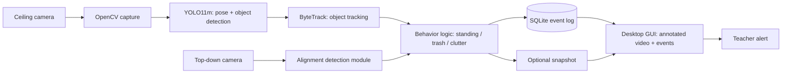
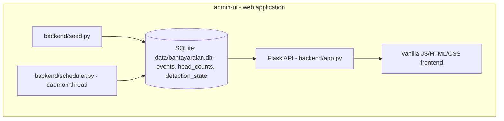

# System Architecture

Two very different things share the name "BantayAralan architecture" right now — keep them distinct.

## 1. Proposed architecture (Proposal Requirement — not implemented)
From the proposal's Conceptual Framework, Block Diagram, and System Flowchart (Figures 1–3) — see [[Research Proposal]].



None of this — capture, YOLO11m, ByteTrack, behavior/alignment logic, or live event generation — exists as code in this repository. See [[04 - Computer Vision]].

## 2. Current implemented architecture (Implemented, UI-only)
One admin-UI web application, generating and consuming its own mock data — no real backend, no detection pipeline behind it. (A second, parallel `desktop-app/` prototype existed through 2026-09-23 and was removed once the finalized prototype paper settled the direction as web-only — see [[Two Admin UI Prototypes]], now historical.)



Implements Dashboard, Events & Logs, Event Detail, Head Count (automated
only, via the background scheduler thread — no manual entry), and
Insights & Statistics
(Statistics / Classroom Insights / Suggestions), plus a Detection
Enable/Disable control and a light/dark theme, against the mock schema in
[[06 - Database]]. The scheduler thread is the one part of this diagram
that runs independently of any HTTP request — see
[[Automated Head-Count Scheduler]].

## 1b. Finalized prototype paper's revised pipeline (Expected by current working draft — UI layer implemented, CV layer not)
From `BantayAralan-Prototype-Paper` (see `Prototype Paper Changes.md`) — resolves open issue 1 (web, not desktop) and adds head count, the detection toggle, and the statistics/insights/suggestions pipeline. The web-app/data-layer half of this is now implemented in `admin-ui/`; the camera/detection half is still section 1 (not implemented):

```text
Camera Input
      -> Continuous Monitoring / Processing
      -> Configured Detection
      -> Detected Condition
      -> Recorded Event + Screenshot/Video Evidence
      -> Accumulated Event History
      -> Statistical / Pattern Analysis
      -> Classroom Insights
      -> Suggestions / Recommendations
      -> Web Application / Reports

Beginning of Class -> Aggregate Student Head Count
Before End of Class -> Aggregate Student Head Count      (independent of the above)

Enable Detection / Disable Detection -> Configured Detection / Event Generation
      (cameras and continuous monitoring/processing stay independent of this toggle)
```

## Status
Section 1: **Proposal Requirement** (original proposal, unimplemented).
Section 2: **Implemented** (UI/data layer only).
Section 1b: **Expected by current working draft** for the CV/detection
layer (not implemented); UI/data layer is **Implemented** in `admin-ui/`.

## Related
- [[04 - Computer Vision]]
- [[Two Admin UI Prototypes]]
- [[06 - Database]]
- [[Event Model]]
- [[Automated Head-Count Scheduler]]
- [[Manual Head-Count Entry Removed]]
- [[UI UX Overview]]
