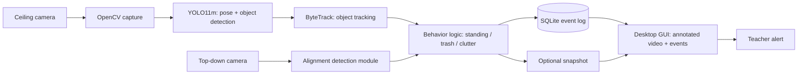
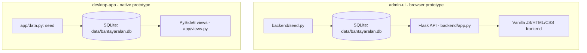

# System Architecture

Two very different things share the name "BantayAralan architecture" right now — keep them distinct.

## 1. Proposed architecture (Proposal Requirement — not implemented)
From the proposal's Conceptual Framework, Block Diagram, and System Flowchart (Figures 1–3) — see [[Research Proposal]].

None of this — capture, YOLO11m, ByteTrack, behavior/alignment logic, or live event generation — exists as code in this repository. See [[04 - Computer Vision]].

## 2. Current implemented architecture (Implemented, UI-only)
Two independent, unconnected admin-UI prototypes, each generating and consuming its own mock data — no shared backend, no detection pipeline behind either:

Both prototypes implement the same three screens (Dashboard, Events & Logs, Event Detail) against the same event schema ([[06 - Database]]), but as **two separate codebases** — see [[Two Admin UI Prototypes]] for why both exist and which is primary.

## Status
Section 1: **Proposal Requirement**. Section 2: **Implemented**.

## Related
- [[04 - Computer Vision]]
- [[Two Admin UI Prototypes]]
- [[06 - Database]]
- [[Event Model]]
- [[UI UX Overview]]
